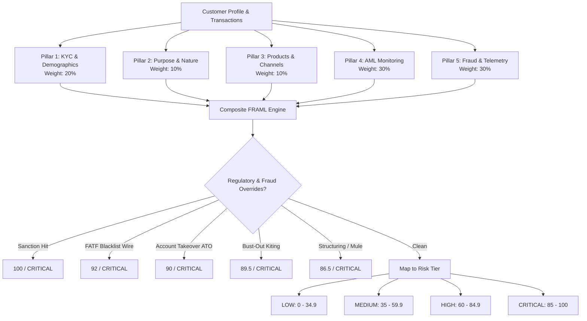

# Synthetic Banking Customer Base & KYC, AML & Fraud Risk Engine (FRAML)

A modular, production-grade synthetic banking customer generation platform and multi-pillar **Financial Crime Risk Engine (FRAML: Fraud + Anti-Money Laundering)** tailored specifically for **individual retail banking customers**.

Built in compliance with international regulatory guidance, including **FATF 40 Recommendations** (Customer Due Diligence & Politically Exposed Persons), **31 U.S. Code § 5324** (Structuring evasion thresholds), and modern digital banking **Fraud & Cybercrime Controls** (Account Takeover, Card Testing, APP Impersonation Scams, Bust-Out, and Synthetic Identity).

---

## 🏛️ System Architecture

```
KYC idea/
├── config/
│   ├── jurisdictions.py      # FATF Blacklist/Greylist, Offshore Secrecy, Low-risk OECD
│   ├── occupations.py        # Inherent AML/CFT industry and occupation risk levels
│   ├── products.py           # Retail products, inherent product risk, channels
│   ├── rules_config.py       # Regulatory thresholds, weights, and AML typology cutoffs
│   └── fraud_config.py       # Fraud parameters (ATO, Card Testing, APP Scams, Bust-Out)
├── models/
│   ├── customer.py           # CustomerProfile, PEP, Adverse Media, Digital Identity & Telemetry
│   ├── transaction.py        # Transaction, direction, channels, device ID, card modes, auth status
│   └── risk_score.py         # CustomerRiskAssessment, RiskTier, AMLAlert, FraudAlert, PillarScore
├── generator/
│   ├── customer_generator.py # Synthetic customer generator (16 archetypes across AML & Fraud)
│   ├── transaction_generator.py # Chronological transaction stream generator
│   └── scenarios.py          # Typology injectors (Structuring, Mule, ATO, Card Testing, Bust-Out)
├── engine/
│   ├── kyc_scorer.py         # Pillar 1 (Demographics/KYC), Pillar 2 (Purpose), Pillar 3 (Products)
│   ├── tm_detector.py        # Pillar 4: Rule-based & heuristic AML anomaly detectors
│   ├── fraud_detector.py     # Pillar 5: First-party & Third-party Fraud anomaly detectors
│   └── risk_engine.py        # Master composite FRAML engine, weighting, overrides, checklists
├── storage/
│   └── database.py           # SQLite database persistence & CSV/JSON tabular exporters
├── cli.py                    # Terminal CLI with Rich formatted tables, panels, and inspection
├── web/
│   ├── server.py             # Zero-dependency local HTTP API server
│   └── static/               # Interactive compliance monitoring dashboard & simulator UI
├── visualization.html        # Standalone interactive HTML visualizer with Chart.js analytics
├── tests/                    # 27 unit & integration tests covering all engine modules
├── exports/                  # Exported CSV tables (customers, transactions, assessments, alerts)
└── requirements.txt
```

---

## ⚙️ Multi-Pillar FRAML Risk Engine Methodology

Individual customer risk is calculated on a normalized **0 to 100 scale** across five weighted pillars:



### 1. Customer KYC & Demographics (20% weight)
* **Citizenship & Residency Risk:** Evaluated against FATF Blacklist, Greylist, and Offshore Secrecy Havens.
* **Residency Discrepancies:** Detects cross-border tax residency mismatches.
* **PEP Status:** Foreign PEP (mandatory statutory EDD), Domestic PEP, and PEP Associates.
* **Adverse Media:** Screening matches for Financial Crime, Corruption/Bribery, Fraud, or Regulatory Enforcement.
* **Sanction Status:** Real-time OFAC / UN screening status.

### 2. Purpose & Nature of Relationship (10% weight)
* Inherent risk of stated account purpose.
* Wealth-to-income plausibility (net worth vs annual income ratios).
* Expected monthly turnover and expected single maximum transaction plausibility.

### 3. Products & Onboarding Channels (10% weight)
* Portfolio inherent risk: Checking, Multi-Currency Wallet, International Wires, Crypto Gateway, Cash Deposit Desk.
* Onboarding channel: Branch in-person biometric chip read vs Digital e-KYC vs Third-Party Intermediary.

### 4. Behavioral & AML Transaction Monitoring (30% weight)
* **TM-01 Structuring / Smurfing:** Detects $\ge 3$ deposits in the $7,500–$9,999 band within 14 days to evade the $10,000 CTR threshold.
* **TM-02 Money Mule / Rapid Movement of Funds:** Inbound wire followed by rapid outbound dissipation ($\ge 85\%$ within 48h) to crypto exchanges.
* **TM-03 Profile Turnover Deviation:** Actual transactional velocity exceeding declared turnover by $\ge 2.5\times$, $5.0\times$, or $10.0\times$.
* **TM-04 Single Transaction Outlier:** Transaction exceeding $\ge 4.0\times$ declared max single transaction.
* **TM-05 High-Risk Geographic Corridors:** Direct wire activity involving FATF Blacklist (KP, IR, MM) or Greylist countries.
* **TM-06 Dormancy Break Surge:** Sudden high-value resumption after $\ge 60$ days of dormancy.

### 5. Fraud Risk & Digital Footprint (30% weight)
* **FR-01 Account Takeover (ATO) & Impossible Travel:** Outbound drain executed from an anomalous device and foreign IP within minutes of a legitimate domestic session (>900 km/h impossible travel).
* **FR-02 Card Testing / Micro-probing:** Botnet running rapid sub-$2.00 authorizations at automated digital services followed by high-dollar CNP orders.
* **FR-03 Authorized Push Payment (APP) / Scams:** Rapid sequence of high-value P2P or wire transfers to brand new unverified individual payees with scam/guaranteed yield narratives.
* **FR-04 First-Party Bust-Out / Deposit Kiting:** Fraudster deposits unverified external ACH funds and immediately maxes out ATM cash withdrawals and P2P transfers within 24 hours before deposit settlement.
* **FR-05 Synthetic Identity Fraud:** Applicant registered with disposable burner email domains (`throwawayinbox.com`), virtual VoIP PBX lines, and SSN issuance date conflict with DOB.

### 3. Products & Onboarding Channels (15% weight)
* Portfolio inherent risk: Checking, Multi-Currency Wallet, International Wires, Crypto Gateway, Cash Deposit Desk, Private Banking.
* Onboarding channel: Branch in-person face-to-face biometric chip read vs Digital e-KYC vs Third-Party Intermediary introduction.

### 4. Behavioral & Transaction Monitoring (40% weight)
* **TM-01 Structuring / Smurfing:** Detects $\ge 3$ cash deposits or wires in the $7,500–$9,999 band within 14 days to evade the $10,000 CTR threshold.
* **TM-02 Money Mule / Rapid Movement of Funds:** Inbound wire followed by rapid outbound dissipation ($\ge 85\%$ within 48h) to crypto exchanges or offshore accounts.
* **TM-03 Profile Turnover Deviation:** Actual transactional velocity exceeding declared turnover by $\ge 2.5\times$, $5.0\times$, or $10.0\times$.
* **TM-04 Single Transaction Outlier:** Transaction exceeding $\ge 4.0\times$ declared max single transaction.
* **TM-05 High-Risk Geographic Corridors:** Direct wire activity involving FATF Blacklist (KP, IR, MM), Greylist, or Secrecy havens.
* **TM-06 Dormancy Break Surge:** Sudden high-value resumption ($\ge \$10,000$) after $\ge 60$ days of dormancy.
* **TM-07 Round-Dollar Amount Clusters:** Repetitive round multiples without commercial cents.

---

## 👥 Synthetic Individual Customer Archetypes

The generator generates distinct, realistic individual customer archetypes with ground-truth labels:
1. `DOMESTIC_SALARIED_LOW_RISK`: Standard domestic salaried employees (engineers, physicians, teachers) with payroll credits and regular living expenses.
2. `RETIRED_PENSIONER`: Senior citizens with pension disbursements and predictable low turnover.
3. `TECH_EXPAT_DIGITAL_NOMAD`: Expatriate professionals with multi-currency accounts and cross-border salary remittances.
4. `HIGH_NET_WORTH_INVESTOR`: Affluent individuals with private wealth management, investment gains, and declared estates.
5. `DOMESTIC_PEP_OFFICIAL`: Senior state or municipal public officials requiring ongoing political exposure oversight.
6. `FOREIGN_PEP_ASSOCIATE`: Close family members of foreign government officials (mandatory statutory EDD).
7. `SOLE_PROPRIETOR_CASH_RETAIL`: Retail, used car, or hospitality sole proprietors with cash handling.
8. `STRUCTURING_CASH_OPERATOR`: Retailer declaring low turnover who deposits repeated tranches under $10,000.
9. `STUDENT_MONEY_MULE`: Young account holder receiving high-value wires and draining to crypto within 24h.
10. `SANCTION_GREYLIST_CORRIDOR`: Individual transacting directly with FATF greylist or blacklist jurisdictions.
11. `ADVERSE_MEDIA_FINANCIAL_CRIME`: Individual flagged with prior regulatory or financial crime media findings.

---

## 🚀 Quickstart & Usage

### 1. Installation
```bash
pip install -r requirements.txt
```

### 2. Generate Synthetic Customer Base & Score Portfolio
Generate 100 individual customers with 90 days of transactions, evaluate through the risk engine, save to SQLite, and export CSV tables:
```bash
python cli.py generate --count 100 --days 90 --seed 42
```

### 3. Inspect Customer 360 Dossier
Inspect a customer's KYC details, risk pillar breakdowns, triggered AML alerts, and audit action checklist:
```bash
python cli.py inspect CUST-00048
```

### 4. Portfolio Summary
View portfolio risk distribution and top triggered AML rules:
```bash
python cli.py summary
```

### 5. Launch Interactive Compliance Web Dashboard
Launch the web interface for compliance analysts and the live risk simulator:
```bash
python3 cli.py serve --port 8088
```
Open **http://localhost:8088** in your browser to view:
* **Customer Monitoring Table:** Search and filter by risk tier, archetype, or name with FRAML, AML, and Fraud scores.
* **Transactions Ledger:** Server-side paginated ledger with direction filters, "Fraud Only" and "AML Suspicious Only" toggles.
* **Customer 360 Dossier Modal:** Detailed demographic breakdown, digital footprint & device telemetry, 5-pillar meters, alert drill-downs, and audit checklists.
* **Live FRAML Risk Engine Simulator:** Adjust customer parameters, inject AML/Fraud typologies (ATO, Card Testing, APP Scam, Bust-Out, Structuring), and compute real-time scores.
* **Cohort Generator & CSV Exports:** Trigger synthetic generation directly from the browser and download CSV files.
* **Typology Attack Pathways:** Visual flow diagrams for Fraud and AML mechanics.

### 6. Run Automated Test Suite
Run the 21 test cases:
```bash
python -m unittest discover tests
```

---

## 📊 Exported Datasets

All generated data is saved to `data/kyc_aml.db` (SQLite) and exported to `exports/`:
* `customers.csv`: All KYC demographics, occupations, declared income, products, PEP, and adverse media flags.
* `transactions.csv`: Full transaction stream with timestamps, amounts, channels, counterparties, and typology tags.
* `risk_assessments.csv`: Composite scores, tier classifications, pillar scores, and recommended actions.
* `alerts.csv`: Itemized AML alerts with supporting transaction IDs, severities, and trigger details.
