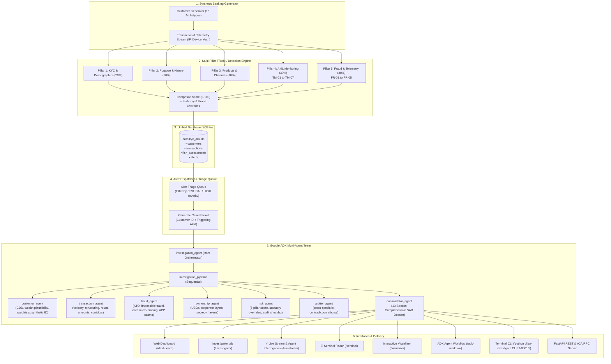

# EvidenceTrail — Financial Crime Investigation & FRAML Platform

EvidenceTrail is a unified banking intelligence platform. A **5-Pillar Financial Crime Risk Engine (FRAML: Fraud + Anti-Money Laundering)** raises alerts, and a **team of AI agents** (Google Agent Development Kit) investigates them: it gathers evidence from the bank's own tools, cross-checks the specialists against each other, and hands a consolidated, evidence-cited case file to a human compliance officer.

> **IMPORTANT COMPLIANCE GUARDRAIL:** All customer, transaction, and device telemetry in this system is **100% synthetic and fictional**. The AI agent team provides evidence analysis and investigative drafts for **human compliance officers**; it does **not** make autonomous legal, SAR filing, or regulatory decisions. A deterministic policy, not a model, sets every simulated outcome.

---

## 🏛️ System Architecture

The platform provides a closed-loop financial crime workflow:



---

## ⚙️ 5-Pillar FRAML Risk Engine

Individual customer risk is calculated on a normalized **0 to 100 scale** across five weighted pillars:

| Pillar | Focus | Weight | Key Typologies & Detectors |
| :--- | :--- | :---: | :--- |
| **Pillar 1: KYC & Demographics** | Identity, Citizenship, Residency, Watchlists | **20%** | Cross-border tax residency mismatches, Foreign PEP EDD (FATF Rec. 12), Adverse Media screening (Financial Crime, Fraud, Corruption), UN/OFAC Sanctions. |
| **Pillar 2: Purpose & Nature** | Relationship Plausibility & Wealth | **10%** | Stated account purpose risk, Wealth-to-income plausibility (net worth vs annual income), declared vs actual monthly turnover expectations. |
| **Pillar 3: Products & Channels** | Inherent Product & Onboarding Risk | **10%** | Product portfolio risk (Crypto Gateway, International Wires, Cash Deposit Desk, Private Banking), onboarding channel (Biometric chip vs Digital e-KYC vs Intermediary). |
| **Pillar 4: AML Transaction Monitoring** | Flow of Funds & Behavioral Anomalies | **30%** | **TM-01**: Structuring ($7.5k–$9.99k CTR evasion)<br/>**TM-02**: Rapid Movement / Money Mule (>85% drained within 48h)<br/>**TM-03**: Turnover Deviation ($\ge 2.5\times, 5.0\times, 10.0\times$ declared)<br/>**TM-04**: Single Transaction Outlier ($\ge 4\times$ declared max)<br/>**TM-05**: High-Risk Corridors (FATF Blacklist KP/IR/MM, Greylist, Offshore Secrecy)<br/>**TM-06**: Dormancy Break Surge ($\ge \$10,000$ after 60 days inactivity)<br/>**TM-07**: Repetitive Round-Dollar Multiples |
| **Pillar 5: Fraud & Cybercrime** | Digital Telemetry & Payment Fraud | **30%** | **FR-01**: Account Takeover (ATO) & Impossible Travel (>900 km/h)<br/>**FR-02**: Card Testing / Micro-probing followed by high-dollar drain<br/>**FR-03**: Authorized Push Payment (APP) / Investment & Romance Scams<br/>**FR-04**: First-Party Bust-Out / Deposit Kiting<br/>**FR-05**: Synthetic Identity Fraud (Burner emails, virtual VoIP PBX) |

### Hard Overrides
- **Sanctions Hit**: Hardcoded to `100.0` (CRITICAL).
- **FATF Blacklist Direct Corridor**: Floor at `92.0` (CRITICAL).
- **Account Takeover (ATO)**: Floor at `90.0` (CRITICAL).
- **First-Party Bust-Out**: Floor at `89.5` (CRITICAL).
- **Pass-through Money Mule**: Floor at `86.5` (CRITICAL).
- **Structuring (31 U.S.C. § 5324)**: Floor at `78.5` (HIGH).
- **Card Testing Micro-Probes**: Floor at `76.0` (HIGH).
- **Synthetic Identity**: Floor at `82.5` (HIGH).

---

## 🤖 Autonomous Google ADK Multi-Agent Team

When an alert is flagged or a customer is inspected, the system dispatches the case to the specialist agents, then an arbiter, then the consolidator. A dynamic triage router (`app/orchestrator/triage.py`) classifies the case topology so specialist effort goes where the risk indicators are.

1. **`customer_agent`**: Verifies CDD identity, plausibility of wealth vs declared income, onboarding channel verification, PEP status, adverse media, and synthetic ID signals.
2. **`transaction_agent`**: Evaluates chronological inflow/outflow velocity, cash intensity, structuring, turnover deviations, round amounts, and high-risk corridors. Uses a bounded, prioritized evidence page (`get_transaction_evidence`) with full-population totals and an explicit warning that omitted records are unreviewed, not clean.
3. **`fraud_agent`**: Investigates device telemetry, recognized vs anomalous device fingerprints, impossible travel velocity (>900 km/h), card entry modes (EMV vs CNP eCommerce), authorization declines, and scam payee velocity.
4. **`ownership_agent`**: Maps beneficial ownership (UBOs), control links, directorships, and checks jurisdictions against FATF Blacklist/Greylist and secrecy haven ratings.
5. **`risk_agent`**: Evaluates the 5-pillar composite score, explains separate AML and Fraud sub-scores, validates statutory and fraud overrides, and generates the compliance action checklist.
6. **`arbiter_agent`** (`app/orchestrator/`): A tribunal that looks for contradictory hypotheses between specialists (money mule vs APP coercion victim, ATO vs friendly fraud, wealth influx vs layered structuring), cross-examines them, and returns a calibrated consensus.
7. **`consolidator_agent`**: Synthesizes all findings into a formal **13-section SAR-ready investigative report**:
   - Case overview (Case ID, Subject, Triage classification, Trigger / Rationale, Scope, Typologies, Priority, Executive Synopsis)
   - Customer overview
   - Key observations
   - Transaction patterns & AML monitoring
   - Fraud & cybercrime telemetry findings
   - Ownership & control findings
   - Relevant risk indicators & FRAML score
   - Evidence supporting each finding (transaction IDs, timestamps, amounts, device IDs)
   - Contradictory or mitigating evidence
   - Multi-specialist cross-debate & contradiction resolution (Arbiter Tribunal ruling)
   - Missing information & investigative gaps
   - Suggested next investigative questions (audit checklist)
   - Overall case summary & human compliance disclaimer

### Context management for the agents
Each specialist sees its own tool exchanges plus the other specialists' written findings, not their raw tool dumps (`app/context_callbacks.py`). Large lists of uniform records are sent in a lossless columnar form. The optional **condense.chat** compression layer (`app/context_compression.py`) is **off by default** (`CONDENSE_ENABLED=0`): it only touches older narrative text, rejects any result that changes a number, name or caution sentence, and falls back to the original text on any error. See `.env.example`.

---

## 🔎 Investigator: transfer-level triage with evidence IDs

The **Investigator** tab (`/investigator`) answers a narrower question than the ADK suite: *should this one transfer be allowed, checked with the customer, or reviewed?* Code lives in `evidencetrail/`.

- **Agent team:** an orchestrator plus three specialists (behaviour & device, recipient & network, risk judge) that call registered tools. Every result is stored as evidence with a stable ID (`EV-001`, ...).
- **Deterministic policy v1 is authoritative.** The model recommends; the policy decides. Agent disagreement is recorded, not hidden.
- **Jev** (risk model) is a tool the risk judge can call and also triages alerts: an alert is raised when Jev or the policy flags a transfer.
- **Auditability:** a hash-chained trace and a saved record per investigation (`data/investigations/`, never committed), restart-safe.
- **Plain-language UI** for bank staff: reasons, missing evidence and next steps; technical details stay saved in the background.
- **Hand-off:** an alert can be passed to the ADK specialist team for a customer-level case file.
- **Seed data:** investigations can run on real transactions from `data/kyc_aml.db`, with time-causal evidence (an agent only sees what was knowable before the transfer) and the generator's labels hidden from the agents.

Quality and impact tooling:

```bash
python -m evidencetrail.live_check            # confirms the Gemini and Jev wire formats against the live APIs
python -m evidencetrail.consistency           # recorded decision-consistency report (run occasionally, e.g. monthly)
python -m evidencetrail.impact --each 24      # rules vs agents vs agents+Jev on labelled seed cases (spends API quota)
```

G-Eval (DeepEval) scores each explanation for evidence grounding, completeness and relevance after the decision; it sits outside the decision path. Measured results, cost assumptions and limits are written up in [`docs/EvidenceTrail-Overview-and-Impact.md`](docs/EvidenceTrail-Overview-and-Impact.md).

---

## ♻️ Self-Evolving Agent Loop

`app/evolution/` closes the loop between adjudicated cases and detection rules: a **Reflexion engine** diagnoses failure modes in cases the arbiter or a human overrode, a **policy optimizer** proposes rule or threshold mutations, a **shadow backtester** compares baseline against the mutation on synthetic regression cases, and the result becomes a **governance proposal** for human approval. Nothing is changed automatically.

---

## 🚀 Quick Start & CLI Usage

All platform commands can be run from the root directory:

### 1. Generate Synthetic Cohort & Run 5-Pillar Engine
```bash
python cli.py generate --count 100 --days 90 --seed 42
```
*Generates 100 customers across 16 archetypes, simulates 90 days of transactions, runs AML and Fraud detectors, saves to SQLite (`data/kyc_aml.db`), and exports CSV tables to `exports/`.*

### 2. View Portfolio Risk & Alert Typologies
```bash
python cli.py portfolio
```

### 3. Inspect a Customer 360 Dossier
```bash
python cli.py inspect CUST-00015
```

### 4. View Alert Triage Queue
```bash
# View all alerts
python cli.py alerts

# Filter by severity and type
python cli.py alerts --severity CRITICAL --type FRAUD
python cli.py alerts --severity CRITICAL --type AML
```

### 5. Trigger Autonomous AI Investigation
```bash
# Run agent team on a flagged customer
python cli.py investigate CUST-00015

# Investigate a customer with a specific triggering alert
python cli.py investigate CUST-00045 --alert-id FR-ALT-ATO-TXN-0103005
```

### 6. Launch Unified Web Dashboard & API Server
```bash
python cli.py serve --port 8000
```
Open in browser:
- **Interactive Compliance Dashboard**: `http://localhost:8000/dashboard`
- **Investigator**: `http://localhost:8000/investigator`
- **ADK Agent Workflow**: `http://localhost:8000/adk-workflow`
- **FRAML Risk Visualizer**: `http://localhost:8000/visualizer`
- **Swagger / OpenAPI Documentation**: `http://localhost:8000/docs`

### 7. Configure keys
Copy `.env.example` to `.env` (gitignored) and add the keys you have: `GEMINI_API_KEY` for the agents and the G-Eval judge, `TYPESAFE_API_KEY` for Jev, and optionally `CONDENSE_API_KEY` with `CONDENSE_ENABLED=1` for context compression. Without keys, live investigations report the provider as unavailable; the unit tests never need keys.

---

## 🧪 Testing & Validation

Run unit tests covering the scoring engine, detectors, agent architectures, the Investigator, the seed adapter, context handling and the impact statistics:

```bash
python -m pytest tests/unit
```
*Unit tests never call live providers (a kill switch and stripped keys enforce it). Seed tests run against a small deterministic fixture database (`tests/unit/seed_fixture.py`), not the regenerated `data/kyc_aml.db`. A few legacy tests in `tests/unit/test_investigator.py` pin the old dataset and arbiter-less pipeline and may fail until they are updated.*

---

## ⚡ Sentinel Real-Time Live Streaming & Autonomous Agent Interrogation

The Sentinel Live Investigator module transforms passive, post-event compliance into an active, real-time protection system:

1. **Real-Time Transaction Stream Waterfall**: Continuous millisecond-speed transaction screening replacing static percentages. Executes Tier-0 micro-heuristics (1.2ms latency) to immediately detect anomalies (e.g. 12.2x baseline expenditure spike) and place funds in **Escrow Soft-Hold (`CONTEXT_CHECK`)**.
2. **Interactive Question Bank (`data/kyc_aml.db`)**: Autonomous AI agent interrogates the customer using structured typologies (`Q_APP_SCAM_SAFE_ACCOUNT`, `Q_ATO_UNRECOGNIZED_SESSION`, `Q_INVOICE_REDIRECT_BEC`) to diagnose coercion, impersonation, or compromise.
3. **Customer Testimony Feedback to Jev Reasoner**: Customer responses are cryptographically recorded into SQLite as non-repudiable audit evidence (`#E07`), and fed back into the **Jev Reasoner** alongside customer baseline (`#E01`), money mule velocity (`#E04`), and entity cluster links (`#E06`).
4. **100% Citable Audit-Ready Compliance Dossier**: Upgrades judgment to `CRITICAL (0.99)` and `CONFIRMED_COERCED_VICTIM`, executing binding escrow freeze (`RULE_COERCION_CONFIRMED_INTERCEPT`) with zero hallucination.

```bash
# Start Sentinel Unified Suite
uvicorn app.fast_api_app:app --port 8000
```
- **Live Stream & Agent Interrogation**: [http://localhost:8000/live-stream](http://localhost:8000/live-stream)
- **Sentinel Particle Radar**: [http://localhost:8000/sentinel](http://localhost:8000/sentinel)
- **Compliance Dashboard**: [http://localhost:8000/dashboard](http://localhost:8000/dashboard)

---

## 📂 Project Structure

```
fin-crime-platform/
├── config/                     # Regulatory, AML, and Fraud thresholds & weights
│   ├── fraud_config.py         # 5-Pillar FRAML weights & fraud parameters
│   ├── jurisdictions.py        # FATF Blacklist/Greylist & Secrecy Havens
│   ├── occupations.py          # Industry risk classifications
│   ├── products.py             # Product risk profiles & channels
│   └── rules_config.py         # AML thresholds (CTR, velocity, dormancy)
├── models/                     # Shared Pydantic data schemas
│   ├── customer.py             # Customer profile & digital identity telemetry
│   ├── transaction.py          # Transaction model with device/IP/auth metadata
│   └── risk_score.py           # 5-pillar assessment, AMLAlert, FraudAlert
├── engine/                     # Deterministic rules & scoring engines
│   ├── kyc_scorer.py           # Pillars 1, 2, and 3 (Demographics, Purpose, Products)
│   ├── tm_detector.py          # Pillar 4: AML rules (TM-01 to TM-07)
│   ├── fraud_detector.py       # Pillar 5: Fraud rules (FR-01 to FR-05)
│   └── risk_engine.py          # Composite 5-pillar engine with hard overrides
├── generator/                  # Standalone synthetic generation engine
│   ├── customer_generator.py   # 16 retail banking customer archetypes
│   ├── transaction_generator.py# Chronological transaction & telemetry generator
│   └── scenarios.py            # Typology injectors (Structuring, Mule, ATO, Bust-Out)
├── storage/                    # Unified database and data export layer
│   └── database.py             # SQLite manager & CSV exporter
├── app/                        # Google ADK Multi-Agent System
│   ├── agent.py                # 5 specialists + arbiter + consolidator + root orchestrator
│   ├── tools.py                # Plain Python tool callable wrappers
│   ├── context_callbacks.py    # Per-agent request filtering, columnar tool results, usage capture
│   ├── context_compression.py  # Optional fail-open condense.chat compression
│   ├── alert_feed.py           # Alert triage queue & agent case packet dispatcher
│   ├── fast_api_app.py         # FastAPI application (A2A RPC + REST APIs + Web UI)
│   ├── orchestrator/           # Dynamic triage router, debate engine, arbiter agent
│   ├── evolution/              # Reflexion, policy optimizer, shadow backtest, governance loop
│   ├── live_agent/             # Real-time stream investigator, policy engine, scenarios
│   └── app_utils/              # A2A protocol and service connectors
├── evidencetrail/              # Investigator: transfer-level agent team, policy, Jev, alerts, records, evaluation
│   ├── team.py                 # Orchestrator + specialists, shared evidence store, trace
│   ├── policy.py               # Deterministic policy v1 (authoritative)
│   ├── jev.py, alerts.py       # Jev client and alert triage / queue
│   ├── seed.py, seed_labels.py # Time-causal seed adapter; evaluator-only answer key
│   ├── evaluator.py            # G-Eval explanation scoring
│   ├── consistency.py          # Recorded decision-consistency report
│   ├── impact.py               # Rules vs agents vs agents+Jev study and cost model
│   └── handoff.py              # Hand-off of an alert to the ADK specialist team
├── web/                        # Web dashboard & interactive pages
│   ├── dashboard.html          # Unified dashboard (alerts, metrics, realtime, Investigator, ADK workflow)
│   ├── investigator.html/.js   # Investigator page
│   ├── adk_workflow.html       # ADK agent workflow studio
│   ├── live_stream.html, sentinel.html, realtime.html
│   ├── visualization.html      # Chart.js interactive visualizer
│   └── static/                 # Live stream assets (live_stream.css/.js)
├── docs/                       # Overview and measured impact report
├── exports/                    # Exported CSV tables (customers, transactions, alerts, assessments)
├── data/                       # SQLite database (kyc_aml.db); local records and reports are gitignored
├── tests/                      # Unit & integration tests (tests/unit/seed_fixture.py is the test seed)
├── cli.py                      # Unified CLI (generate, portfolio, inspect, alerts, investigate, serve)
├── pyproject.toml              # Dependencies & build configuration
├── agents-cli-manifest.yaml    # Google ADK manifest
└── AGENTS.md                   # Agent developer guidance
```
