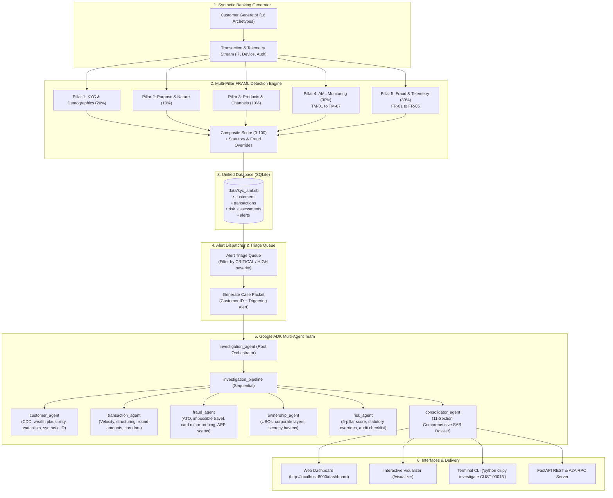

# Financial Crime Investigation & FRAML Platform

A unified enterprise banking intelligence platform combining a **5-Pillar Financial Crime Risk Engine (FRAML: Fraud + Anti-Money Laundering)** with an autonomous **Google Agent Development Kit (ADK) Multi-Agent AI Investigation Team**.

> **IMPORTANT COMPLIANCE GUARDRAIL:** All customer, transaction, and device telemetry in this system is **100% synthetic and fictional**. The AI agent team provides evidence analysis and investigative drafts for **human compliance officers**; it does **not** make autonomous legal, SAR filing, or regulatory decisions.

---

## 🏛️ System Architecture

The platform provides a closed-loop financial crime workflow:



---

## ⚙️ 5-Pillar FRAML Risk Engine

Individual customer risk is calculated on a normalized **0 to 100 scale** across five weighted pillars:

| Pillar | Focus | Weight | Key Typologies & Detectors |
| :--- | :--- | :---: | :--- |
| **Pillar 1: KYC & Demographics** | Identity, Citizenship, Residency, Watchlists | **20%** | Cross-border tax residency mismatches, Foreign PEP EDD (FATF Rec. 12), Adverse Media screening (Financial Crime, Fraud, Corruption), UN/OFAC Sanctions. |
| **Pillar 2: Purpose & Nature** | Relationship Plausibility & Wealth | **10%** | Stated account purpose risk, Wealth-to-income plausibility (net worth vs annual income), declared vs actual monthly turnover expectations. |
| **Pillar 3: Products & Channels** | Inherent Product & Onboarding Risk | **10%** | Product portfolio risk (Crypto Gateway, International Wires, Cash Deposit Desk, Private Banking), onboarding channel (Biometric chip vs Digital e-KYC vs Intermediary). |
| **Pillar 4: AML Transaction Monitoring** | Flow of Funds & Behavioral Anomalies | **30%** | **TM-01**: Structuring ($7.5k–$9.99k CTR evasion)<br/>**TM-02**: Rapid Movement / Money Mule (>85% drained within 48h)<br/>**TM-03**: Turnover Deviation ($\ge 2.5\times, 5.0\times, 10.0\times$ declared)<br/>**TM-04**: Single Transaction Outlier ($\ge 4\times$ declared max)<br/>**TM-05**: High-Risk Corridors (FATF Blacklist KP/IR/MM, Greylist, Offshore Secrecy)<br/>**TM-06**: Dormancy Break Surge ($\ge \$10,000$ after 60 days inactivity)<br/>**TM-07**: Repetitive Round-Dollar Multiples |
| **Pillar 5: Fraud & Cybercrime** | Digital Telemetry & Payment Fraud | **30%** | **FR-01**: Account Takeover (ATO) & Impossible Travel (>900 km/h)<br/>**FR-02**: Card Testing / Micro-probing followed by high-dollar drain<br/>**FR-03**: Authorized Push Payment (APP) / Investment & Romance Scams<br/>**FR-04**: First-Party Bust-Out / Deposit Kiting<br/>**FR-05**: Synthetic Identity Fraud (Burner emails, virtual VoIP PBX) |

### Hard Overrides
- **Sanctions Hit**: Hardcoded to `100.0` (CRITICAL).
- **FATF Blacklist Direct Corridor**: Floor at `92.0` (CRITICAL).
- **Account Takeover (ATO)**: Floor at `90.0` (CRITICAL).
- **First-Party Bust-Out**: Floor at `89.5` (CRITICAL).
- **Pass-through Money Mule**: Floor at `86.5` (CRITICAL).
- **Structuring (31 U.S.C. § 5324)**: Floor at `78.5` (HIGH).
- **Card Testing Micro-Probes**: Floor at `76.0` (HIGH).
- **Synthetic Identity**: Floor at `82.5` (HIGH).

---

## 🤖 Autonomous Google ADK Multi-Agent Team

When an alert is flagged or a customer is inspected, the system dispatches the case to 5 specialist agents followed by the consolidator:

1. **`customer_agent`**: Verifies CDD identity, plausibility of wealth vs declared income, onboarding channel verification, PEP status, adverse media, and synthetic ID signals.
2. **`transaction_agent`**: Evaluates chronological inflow/outflow velocity, cash intensity, structuring, turnover deviations, round amounts, and high-risk corridors.
3. **`fraud_agent`**: Investigates device telemetry, recognized vs anomalous device fingerprints, impossible travel velocity (>900 km/h), card entry modes (EMV vs CNP eCommerce), authorization declines, and scam payee velocity.
4. **`ownership_agent`**: Maps beneficial ownership (UBOs), control links, directorships, and checks jurisdictions against FATF Blacklist/Greylist and secrecy haven ratings.
5. **`risk_agent`**: Evaluates the 5-pillar composite score, explains separate AML and Fraud sub-scores, validates statutory and fraud overrides, and generates the compliance action checklist.
6. **`consolidator_agent`**: Synthesizes all findings into a formal **11-section SAR-ready investigative report**:
   - Case overview (Case ID, Subject, Trigger / Rationale, Scope, Typologies, Priority, Executive Synopsis)
   - Customer overview
   - Key observations
   - Transaction patterns & AML monitoring
   - Fraud & cybercrime telemetry findings
   - Ownership & control findings
   - Relevant risk indicators & FRAML score
   - Evidence supporting each finding (transaction IDs, timestamps, amounts, device IDs)
   - Contradictory or mitigating evidence
   - Missing information & investigative gaps
   - Suggested next investigative questions (audit checklist)
   - Overall case summary & human compliance disclaimer

---

## 🚀 Quick Start & CLI Usage

All platform commands can be run from the root directory:

### 1. Generate Synthetic Cohort & Run 5-Pillar Engine
```bash
python cli.py generate --count 100 --days 90 --seed 42
```
*Generates 100 customers across 16 archetypes, simulates 90 days of transactions, runs AML and Fraud detectors, saves to SQLite (`data/kyc_aml.db`), and exports CSV tables to `exports/`.*

### 2. View Portfolio Risk & Alert Typologies
```bash
python cli.py portfolio
```

### 3. Inspect a Customer 360 Dossier
```bash
python cli.py inspect CUST-00015
```

### 4. View Alert Triage Queue
```bash
# View all alerts
python cli.py alerts

# Filter by severity and type
python cli.py alerts --severity CRITICAL --type FRAUD
python cli.py alerts --severity CRITICAL --type AML
```

### 5. Trigger Autonomous AI Investigation
```bash
# Run agent team on a flagged customer
python cli.py investigate CUST-00015

# Investigate a customer with a specific triggering alert
python cli.py investigate CUST-00045 --alert-id FR-ALT-ATO-TXN-0103005
```

### 6. Launch Unified Web Dashboard & API Server
```bash
python cli.py serve --port 8000
```
Open in browser:
- **Interactive Compliance Dashboard**: `http://localhost:8000/dashboard`
- **FRAML Risk Visualizer**: `http://localhost:8000/visualizer`
- **Swagger / OpenAPI Documentation**: `http://localhost:8000/docs`

---

## 🧪 Testing & Validation

Run unit tests covering the scoring engine, detectors, and agent architectures:

```bash
python -m pytest tests/unit
```
*46 tests covering fraud detectors, transaction monitoring rules, KYC scoring, composite risk engine, and ADK agent tool mappings.*

---

## 📂 Project Structure

```
fin-crime-platform/
├── config/                     # Regulatory, AML, and Fraud thresholds & weights
│   ├── fraud_config.py         # 5-Pillar FRAML weights & fraud parameters
│   ├── jurisdictions.py        # FATF Blacklist/Greylist & Secrecy Havens
│   ├── occupations.py          # Industry risk classifications
│   ├── products.py             # Product risk profiles & channels
│   └── rules_config.py         # AML thresholds (CTR, velocity, dormancy)
├── models/                     # Shared Pydantic data schemas
│   ├── customer.py             # Customer profile & digital identity telemetry
│   ├── transaction.py          # Transaction model with device/IP/auth metadata
│   └── risk_score.py           # 5-pillar assessment, AMLAlert, FraudAlert
├── engine/                     # Deterministic rules & scoring engines
│   ├── kyc_scorer.py           # Pillars 1, 2, and 3 (Demographics, Purpose, Products)
│   ├── tm_detector.py          # Pillar 4: AML rules (TM-01 to TM-07)
│   ├── fraud_detector.py       # Pillar 5: Fraud rules (FR-01 to FR-05)
│   └── risk_engine.py          # Composite 5-pillar engine with hard overrides
├── generator/                  # Standalone synthetic generation engine
│   ├── customer_generator.py   # 16 retail banking customer archetypes
│   ├── transaction_generator.py# Chronological transaction & telemetry generator
│   └── scenarios.py            # Typology injectors (Structuring, Mule, ATO, Bust-Out)
├── storage/                    # Unified database and data export layer
│   └── database.py             # SQLite manager & CSV exporter
├── app/                        # Google ADK Multi-Agent System
│   ├── agent.py                # 5 specialist agents + consolidator + root orchestrator
│   ├── tools.py                # Plain Python tool callable wrappers
│   ├── alert_feed.py           # Alert triage queue & agent case packet dispatcher
│   ├── fast_api_app.py         # FastAPI application (A2A RPC + REST APIs + Web UI)
│   └── app_utils/              # A2A protocol and service connectors
├── web/                        # Web dashboard & interactive visualizers
│   ├── static/                 # Compliance monitoring dashboard (app.js, style.css, index.html)
│   ├── visualization.html      # Chart.js interactive visualizer
│   └── Financialcrime.html     # High-density Nordic screening visualizer
├── exports/                    # Exported CSV tables (customers, transactions, alerts, assessments)
├── data/                       # SQLite database (kyc_aml.db)
├── tests/                      # 46 unit & integration tests
├── cli.py                      # Unified CLI (generate, portfolio, inspect, alerts, investigate, serve)
├── pyproject.toml              # Dependencies & build configuration
├── agents-cli-manifest.yaml    # Google ADK manifest
└── AGENTS.md                   # Agent developer guidance
```
